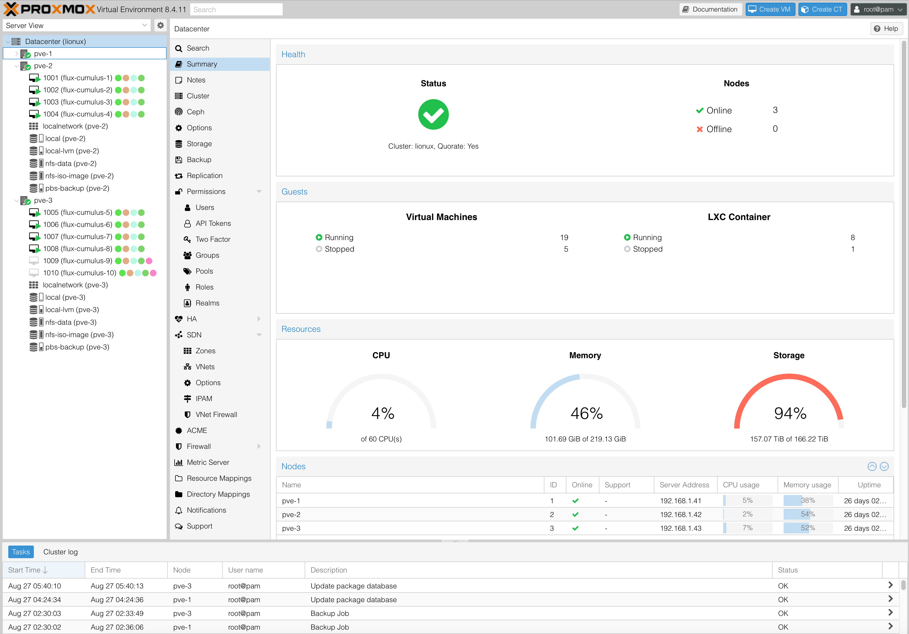
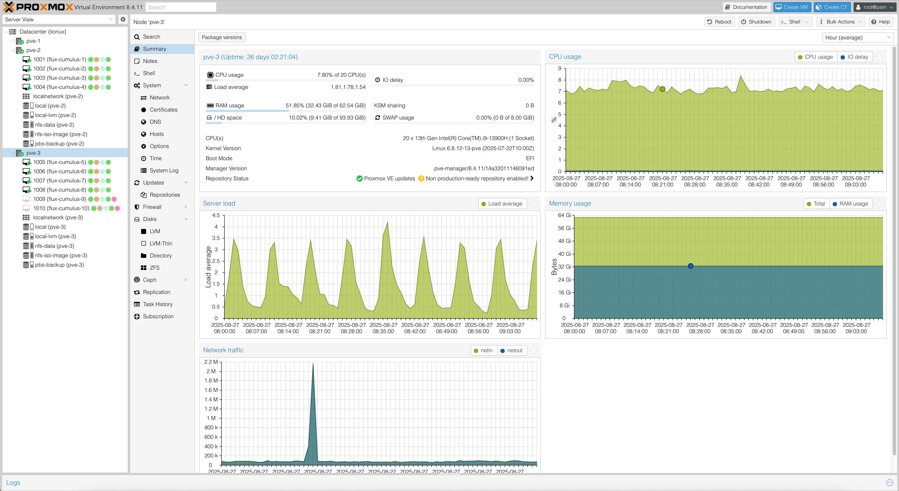

<h1 align="center">Home Production Network Setup 🏠</h1>
 
I’ve had several versions of my home production network. Due to rising electricity costs in the Netherlands, I’ve built my latest setup using energy-efficient hardware. Previously, I used servers with Xeon processors, but now my servers are based on laptop hardware, which helps keep power consumption low while still delivering good performance. Modern laptops nowadays often feature many CPU cores and support large amounts of memory, making them an excellent choice for homelabs. I’m a big fan of Ubiquiti UniFi products, and my UniFi hardware is also quite energy-efficient. Compared to my older self-built NAS systems, which consumed significantly more power, my UniFi NAS are much more efficient thanks to their ARM processors.
 
 
<table>
  <tr>
    <td align="center">
       
      <i>2009</i>
    </td>
    <td align="center">
       
      <i>2011</i>
    </td>
  </tr>
  <tr>
    <td align="center">
       
      <i>2017</i>
    </td>
    <td align="center">
       
      <i>current</i>  
    </td>
  </tr>
</table>
 
<h2 align="center">Hardware ⚙️</h2>
 
  <ul>
    <li>UDM Pro SE</li>
    <li>USW-Aggregation</li>
    <li>2x U6 Pro</li>
    <li>G4 Instant</li>
    <li>UNAS Pro</li>
    <li>3x Minisform MS-01 / i9-13900H, 96GB, 1TB NVMe (Proxmox Virtual Environment 1, 2 ,3)</li>
    <li>1x Minisform MS-01 / i5-12600H, 32GB, 1TB NVMe (Proxmox Backup Server)</li>
    <li>CyberPower UPS</li>
  </ul>
 
<h2 align="center">Unifi 🛜</h2> 
 
My network is built using Unifi devices, and for storage, I rely on a U-NAS Pro unit with a couple of 22TB drives." 
 
<h2 align="center">Minisform 🖥️</h2> 
 
The Minisforum MS-01 is a compact, high-performance mini workstation/server designed for professional and homelab use. It's packed with powerful features like 2.5gbe ethernet, SFP+ that make it suitable for virtualization, containerization, and other homeLab stuff.
 
<h2 align="center">Software that I use in my homelab 🧑‍💻 </h2> 
 
<ul>
  <li>Unifi Network</li>
  <li>Unfi Drive</li>
  <li>Unifi Protect</li>
  <li>Proxmox Virtual Enviroment (Type 1 Hypevisor)</li>
  <li>Proxmox Backup Server</li>
  <li>Ubuntu Server</li>
  <li>Windows</li>
  <li>Windows Server</li>
  <li>MacOS</li>
  <li>iOS</li>
  <li>Kubernetes</li>
</ul>

 
 
<i>datacenter overview</i>
 
<h2 align="center">Virtual Machines 📦</h2> 
 
<ul>
  <li>Uptime Kuma</li>
  <li>Wazuh</li>
  <li>Plex</li>
  <li>Tautulli</li>
  <li>Homarr</li>
  <li>Nimbus Node 1 (Runonflux project expalined below)</li>
  <li>Nimbus Node 2</li>  
  <li>Presearch node 1 (Presearch project explained below)</li>
  <li>Presearch node 2</li>
  <li>Presearch node 3</li>
  <li>Presearch node 4</li>
  <li>Presearch node 5</li>
  <li>Presearch node 6</li>
  <li>Presearch node 7</li>
  <li>PreSeeker</li>
  <li>PreCrawler</li>
  <li>Neoxa smart node 1</li>
  <li>Netsis master node</li>
  <li>Windows 11 Pro</li>
  <li>Windows Server 2022</li>
  <li>K8s-control-plane-1</li>
  <li>K8s-worker-1</li>
  <li>K8s-worker-2</li>
</ul>
   

 
 
<i>pve-3 overview</i>
 
<h2 align="center">Storage 💿</h2> 
 
<ul>
  <li>VM's run at the moment on local storage</li>
  <li>Data shares via NFS mounts to UNAS Pro</li>
</ul>
  
<h2 align="center">What is RunOnFlux? ✅</h2> 
 
RunOnFlux is a decentralized cloud computing platform that allows users to rent out their computing resources (like CPUs, GPUs, and storage) to run applications, host services, or perform tasks in a distributed network. It is part of the Flux ecosystem, which aims to create a decentralized infrastructure for Web3 and cloud-native applications.
 
The idea is to build a peer-to-peer network of nodes that provide computing power and resources in a decentralized way, removing the need for traditional centralized cloud providers like AWS, Google Cloud, or Azure.
 
<h2 align="center">What is Presearch? ✅</h2> 
 
Presearch is a decentralized search engine that prioritizes user privacy, transparency, and control over the search experience. Unlike traditional search engines like Google, which collect and monetize your search data through advertising, Presearch focuses on protecting your privacy and rewarding users for using the platform.
 
Presearch leverages blockchain technology and a community-driven model. Users can earn Presearch’s native token (PRE) by performing searches and can use these tokens within the ecosystem. The platform also supports independent content and advertisers without a centralized intermediary.
 
<h2 align="center">What is Neoxa? ✅</h2> 
 
Neoxa is a blockchain-based project that merges gaming with cryptocurrency. It allows gamers to earn Neoxa Coins (NEOX) by playing popular games. The idea is to bridge traditional gaming with the Web3 ecosystem, enabling players to "play and earn."
 
<h2 align="center">What is Netsis? ✅</h2> 
 
Netsis (NET) is a blockchain project focused on providing cybersecurity solutions. It aims to integrate blockchain technology with cybersecurity services, offering tools for endpoint protection, data security, and user behavior analytics. The project operates its own blockchain and has a maximum supply of 210 million NET tokens.
 
<h2 align="center">On the to-do list ❎</h2> 
<ul>
  <li>New dashboard</li>
  <li>Monitor software</li>
  <li>Learn Kubernetes</li>
  <li>Learn Python?</li>
</ul>
<h2 align="center">Hardware I like to add or change 💰</h2> 
 
<ul>
  <li>Pro Max 24 PoE</li>
  <li>Pro XG 10 PoE</li>
  <li>U7 Pro XG</li>
  <li>A second UNAS Pro with only SSD storage or a nvme storage device</li>
  <li>Upgrade the hypevisors (MS-01) from 96GB to 128GB memory</li>
  <li>Add a Samsung 990 Pro 4Tb nvme ssd to each hypevisor. So OS and VM are seperated</li>
  <li>Seperate Kubernetes cluster??? 🤔</li>
</ul>